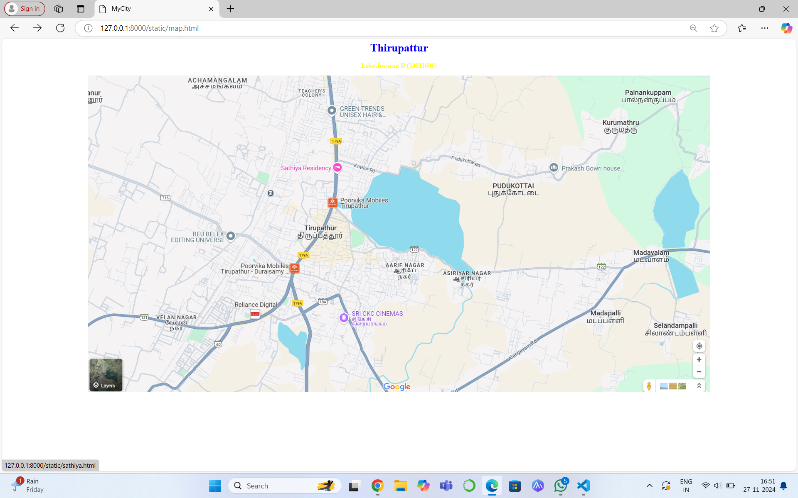
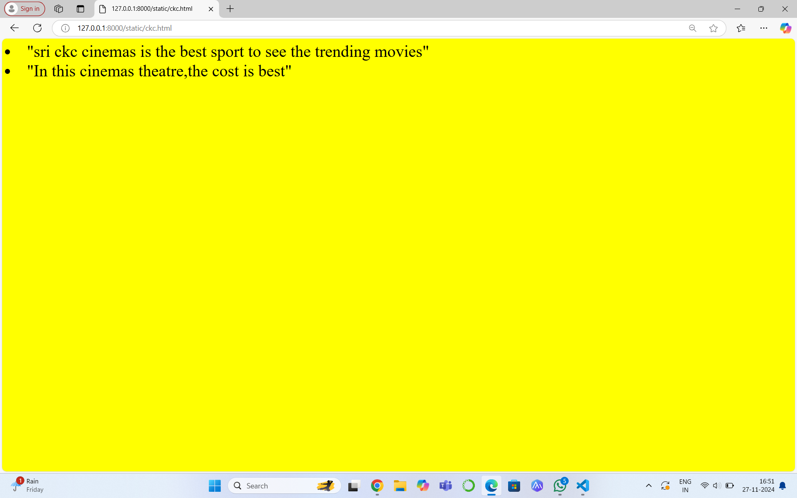
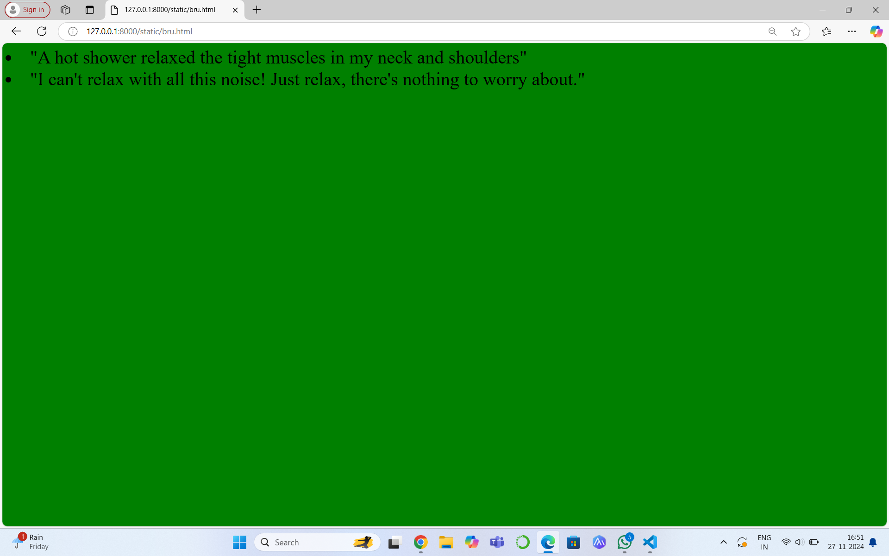
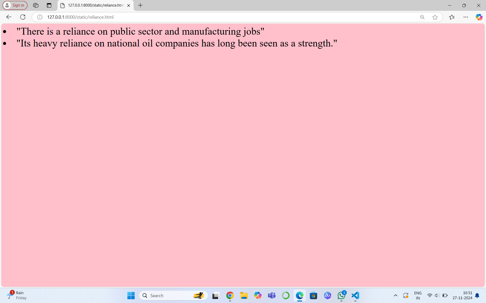
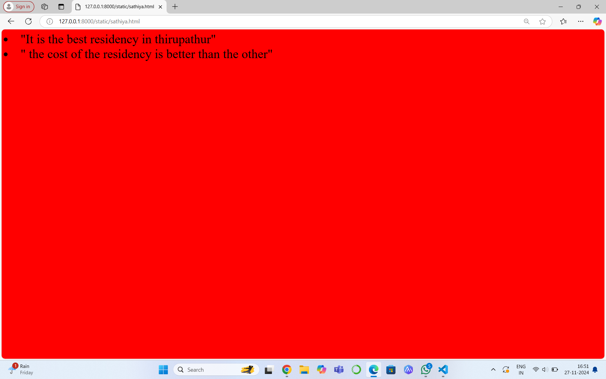
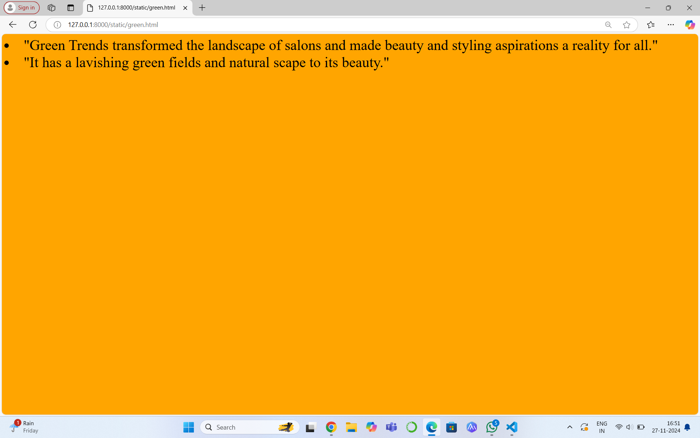
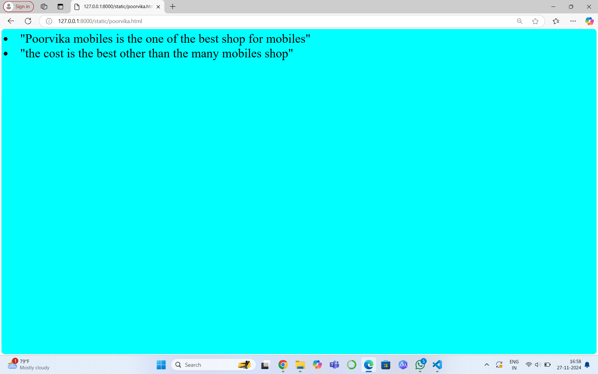

# Ex04 Places Around Me
## Date: 27-11-2024

## AIM
To develop a website to display details about the places around my house.

## DESIGN STEPS

### STEP 1
Create a Django admin interface.

### STEP 2
Download your city map from Google.

### STEP 3
Using ```<map>``` tag name the map.

### STEP 4
Create clickable regions in the image using ```<area>``` tag.

### STEP 5
Write HTML programs for all the regions identified.

### STEP 6
Execute the programs and publish them.

## CODE
```
map.html

<html>
 <head>
 <title>MyCity</title>
 </head>
 <body>
<h1 align="center">
 <font color="blue"><b>Thirupattur</b></font>
 </h1>
 <h3 align="center">
 <font color="Yellow">Lokeshwaran R  (24011606)</font>
 </h3>
 <center>
 
 

 <map name="MyCity">
    <area target="" alt="Green trends" title="Green trends" href="green.html" coords="681,86,877,131" shape="rect">
    <area target="" alt="Poorvika" title="Poorvika" href="poorvika.html" coords="678,333,892,390" shape="rect">
    <area target="" alt="Sathiya" title="Sathiya" href="sathiya.html" coords="551,248,747,283" shape="rect">
    <area target="" alt="Reliance" title="Reliance" href="reliance.html" coords="410,636,564,723" shape="rect">
    <area target="" alt="Bru" title="Bru" href="bru.html" coords="223,434,443,496" shape="rect">
    <area target="" alt="CKC" title="CKC" href="ckc.html" coords="728,667,928,735" shape="rect">
</map>
</center>
</body>
</html>

ckc.html

<html>
<body bgcolor="yellow">
<font size="100">
<li>"sri ckc cinemas is the best sport to see the trending movies"</li>
<li>"In this cinemas theatre,the cost is best"</li>
</font>
</body>
</html

bru.html

<html>
<body bgcolor="green">
<font size="100">
<li>"A hot shower relaxed the tight muscles in my neck and shoulders"</li>
<li>"I can't relax with all this noise! Just relax, there's nothing to worry about."</li>
</font>
</body>
</html

reliance.html

<html>
<body bgcolor="pink">
<font size="100">
<li>"There is a reliance on public sector and manufacturing jobs"</li>
<li>"Its heavy reliance on national oil companies has long been seen as a strength."</li>
</font>
</body>
</html

sathiya.html

<html>
<body bgcolor="red">
<font size="100">
<li>"It is the best residency in thirupathur"</li>
<li>" the cost of the residency is better than the other"</li>
</font>
</body>
</html

green.html

<html>
<body bgcolor="orange">
<font size="100">
<li>"Green Trends transformed the landscape of salons and made beauty and styling aspirations a reality for all."</li>
<li>"It has a lavishing green fields and natural scape to its beauty."</li>
</font>
</body>
</html

poorvika.html

<html>
<body bgcolor="cyan">
<font size="100">
<li>"Poorvika mobiles is the one of the best shop for mobiles"</li>
<li>"the cost is the best other than the many mobiles shop"</li>
</font>
</body>
</html

```


## OUTPUT







## RESULT
The program for implementing image maps using HTML is executed successfully.
